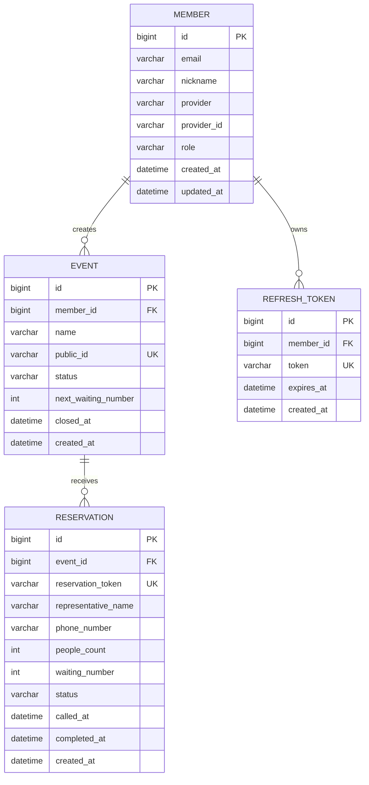

# QuickQueue

## 목차

1. [프로젝트 소개](#1-프로젝트-소개)
2. [프로젝트 개요](#2-프로젝트-개요)
3. [기술 스택](#3-기술-스택)
4. [주요 기능](#4-주요-기능)
5. [ERD](#5-erd)
6. [API 명세서](#6-api-명세서)

## 1. 프로젝트 소개

QuickQueue는 별도의 앱 설치 없이 웹에서 바로 사용할 수 있는 단기 운영형 예약 서비스입니다.

장기간 운영을 전제로 한 예약 플랫폼은 입점 신청, 전화 상담, 계약서 작성 등 도입 과정에 부담이 생길 수 있습니다. QuickQueue는 이러한 과정을 줄이고, 행사·팝업·임시 매장처럼 단기간 예약 서비스를 운영해야 하는 관리자가 빠르게 대기열을 개설하고 운영할 수 있도록 설계했습니다.

고객은 공개된 이벤트 링크에서 대표자 정보와 인원, 전화번호를 입력해 예약할 수 있습니다. 관리자는 카카오 OAuth 로그인 후 이벤트를 만들고, 예약자의 대기 상태를 실시간으로 관리할 수 있습니다.

## 2. 프로젝트 개요

| 항목 | 내용 |
| --- | --- |
| 프로젝트명 | QuickQueue |
| 서비스 형태 | 웹 기반 예약 및 대기열 관리 서비스 |
| 주요 사용자 | 단기간 예약 서비스를 운영하는 관리자, 예약 고객 |
| 관리자 인증 | 카카오 OAuth 2.0 로그인 |
| 고객 이용 방식 | 공개 이벤트 링크를 통한 예약 |
| 실시간 통신 | Server-Sent Events(SSE) |
| 배포 구성 | Docker Compose 기반 프론트엔드·백엔드·MySQL 구성 |

관리자는 이벤트를 생성하면 고유한 `publicId`를 발급받습니다. 고객은 이 식별자를 포함한 공개 링크에서 예약하고, 발급된 `reservationToken`으로 자신의 대기번호와 상태를 확인합니다.

## 3. 기술 스택

### Frontend

- React 18
- TypeScript
- Vite
- React Router DOM
- Axios
- `@microsoft/fetch-event-source`

### Backend / DB

- Java 17
- Spring Boot 3.5.13
- Spring Web
- Spring Data JPA
- Spring Security
- Spring OAuth2 Client
- Spring Validation
- JSON Web Token(JJWT) 0.12.6
- Lombok
- Solapi SDK: SMS 연동
- MySQL 8.0
- H2 Database : 로컬 개발 / 테스트

### 인프라 / CICD

- AWS EC2
- Docker / Docker Compose
- GitHub Actions

## 4. 주요 기능

### 고객 기능

- 대표자명, 인원 수, 전화번호를 이용한 예약 생성
- SSE를 이용한 본인 예약 현황 실시간 조회
- SMS를 통해 입장 여부 확인 가능

### 관리자 기능

- 카카오 OAuth 로그인
- 이벤트 생성 및 관리자 이벤트 목록 조회
- 이벤트 상세 조회 및 이벤트 마감
- 이벤트별 예약 목록 조회
- 예약자 호출, 완료, 취소 처리
- SSE를 이용한 예약 목록 실시간 수신

### 인증 및 상태

- 관리자 API는 JWT 기반 인증을 사용합니다.
- 로그인 성공 시 액세스 토큰은 프론트엔드로 전달되고, 리프레시 토큰은 `HttpOnly` 쿠키에 저장됩니다.
- 이벤트 상태는 `OPEN`, `CLOSED`로 관리됩니다.
- 예약 상태는 `WAITING`, `CALLED`, `COMPLETED`, `CANCELED`로 관리됩니다.

## 5. ERD



## 6. API 명세서

### 공통 사항

- 기본 경로는 백엔드 서버 주소입니다.
- 관리자 API는 `Authorization: Bearer {accessToken}` 인증이 필요합니다.
- 요청 및 일반 응답 본문은 JSON을 사용합니다.
- 성공 시 생성·조회 API는 `200 OK`, 상태 변경 API는 본문 없이 `204 No Content`를 반환합니다.

### 인증

| Method | Endpoint | 인증 | 설명 |
| --- | --- | --- | --- |
| GET | `/oauth2/authorization/kakao` | 없음 | 카카오 OAuth 로그인 시작 |
| POST | `/api/auth/reissue` | `refreshToken` 쿠키 | 액세스 토큰 재발급 |
| POST | `/api/auth/logout` | `refreshToken` 쿠키 | 리프레시 토큰 폐기 및 쿠키 삭제 |

로그인 성공 후 백엔드는 액세스 토큰을 프론트엔드로 전달하고 리프레시 토큰을 쿠키에 저장합니다. OAuth 콜백 경로는 `/login/oauth2/code/kakao`입니다.

### 이벤트

| Method | Endpoint | 인증 | 설명 |
| --- | --- | --- | --- |
| POST | `/api/admin/events` | 필요 | 관리자 이벤트 생성 |
| GET | `/api/admin/events` | 필요 | 관리자의 이벤트 목록 조회 |
| GET | `/api/admin/events/{publicId}` | 필요 | 관리자 이벤트 상세 조회 |
| POST | `/api/admin/events/{publicId}/close` | 필요 | 이벤트 마감 |
| GET | `/api/events/{publicId}` | 불필요 | 공개 이벤트 조회 |

#### 이벤트 생성 요청

```json
{
	"name": "팝업스토어 예약"
}
```

#### 이벤트 응답

```json
{
	"id": 1,
	"name": "팝업스토어 예약",
	"publicId": "public-event-id",
	"status": "OPEN"
}
```

### 예약

| Method | Endpoint | 인증 | 설명 |
| --- | --- | --- | --- |
| POST | `/api/reservations/{publicId}` | 불필요 | 공개 이벤트 예약 생성 |
| GET | `/api/reservations/{reservationToken}` | 불필요 | 예약 상태 조회 |
| GET | `/api/reservations/{reservationToken}/sse/connect` | 불필요 | 고객 예약 상태 SSE 연결 |
| GET | `/api/reservations/{publicId}/admin/sse/connect` | 필요 | 관리자 예약 목록 SSE 연결 |
| GET | `/api/admin/reservations/{publicId}` | 필요 | 이벤트 예약 목록 조회 |
| POST | `/api/admin/reservations/{publicId}/{reservationToken}/call` | 필요 | 예약자 호출 |
| POST | `/api/admin/reservations/{publicId}/{reservationToken}/complete` | 필요 | 예약 완료 처리 |
| POST | `/api/admin/reservations/{publicId}/{reservationToken}/cancel` | 필요 | 예약 취소 처리 |

#### 예약 생성 요청

```json
{
	"representativeName": "홍길동",
	"peopleCount": 2,
	"phoneNumber": "010-1234-5678"
}
```

#### 예약 목록 응답

```json
{
	"id": 1,
	"representativeName": "홍길동",
	"peopleCount": 2,
	"waitingNumber": 3,
	"waitingAhead": 1,
	"reservationToken": "reservation-token",
	"status": "WAITING"
}
```

#### 예약 상태 응답

```json
{
	"waitingNumber": 3,
	"status": "WAITING",
	"waitingAhead": 1
}
```

고객 SSE 연결에서는 예약 상태에 따라 `waiting`, `called`, `completed`, `canceled` 이벤트가 전달됩니다. 관리자 SSE 연결은 연결 직후 `connected` 이벤트로 해당 이벤트의 예약 목록을 전달합니다.

### SSE 응답 형식

SSE 엔드포인트는 `Content-Type: text/event-stream`을 사용합니다. 예시는 다음과 같습니다.

```text
event: waiting
data: {"waitingNumber":3,"status":"WAITING","waitingAhead":1}
```
